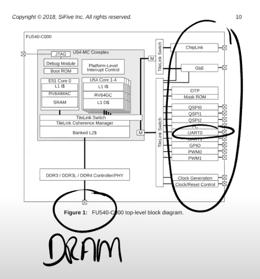

# Interrupts and device drivers

## 1. Interrupt
```
Hardware:    want attention now

Software:    save its work
             process interrupt
             resume its work
```

例如
- 网卡收到了一个packet，网卡会生成一个中断；
- 用户通过键盘按下了一个按键，键盘会产生一个中断。
  操作系统需要做的是，保存当前的工作，处理中断，处理完成之后再恢复之前的工作。这里的保存和恢复工作，与我们之前看到的系统调用(syscall)过程（注，详见lec06）非常相似。所以系统调用，page fault，中断，都使用相同的机制

 
中断与系统调用主要有3个小的差别：

- asynchronous。
  当硬件生成中断时,   Interrupt handler与当前运行的进程在CPU上没有任何关联。但如果是系统调用的话，系统调用发生在运行进程的 context下。

- concurrency
  对于中断来说，CPU和生成中断的设备是并行的在运行。
  网卡自己独立的处理来自网络的packet，然后在某个时间点产生中断，但是同时，CPU也在运行。所以我们在CPU和设备之间是真正的并行的，我们必须管理这里的并行。

- program device。
  我们这节课主要关注外部设备，例如网卡，UART，而这些设备需要被编程。每个设备都有一个编程手册，就像RISC-V有一个包含了指令和寄存器的手册一样。设备的编程手册包含了它有什么样的寄存器，它能执行什么样的操作，在读写控制寄存器的时候，设备会如何响应。不过通常来说，设备的手册不如RISC-V的手册清晰，这会使得对于设备的编程会更加复杂。


## 2 Interrupt 硬件部分

### 中断是从哪里产生的？

因为我们主要关心的是外部设备的中断，而不是定时器中断或者软件中断。外设中断来自于主板上的设备，下图是一个SiFive主板，如果你查看这个主板，你可以发现有大量的设备连接在或者可以连接到这个主板上。


主板可以连接以太网卡，MicroUSB，MicroSD等，主板上的各种线路将外设和CPU连接在一起。这节课的大部分内容都会介绍当设备产生中断时CPU会发生什么，以及如何从设备读写数据。

下图是来自于SiFive有关处理器的文档，图中的右侧是各种各样的设备，例如UART0。我们在之前的课程已经知道UART0会映射到内核内存地址的某处，而所有的物理内存都映射在地址空间的 0x80000000 之上。（注，详见4.5）。类似于读写内存，通过向相应的设备地址执行load/store指令，我们就可以对例如UART的设备进行编程。



### Platform Level Interrupt Control(PLIC)


所有的设备都连接到处理器上，处理器上是通过 `Platform Level Interrupt Control(PLIC)` 来处理设备中断。PLIC 会管理来自于外设的中断。如果我们再进一步深入的查看 PLIC 的结构图


从左上角可以看出，我们有53个不同的来自于设备的中断。这些中断到达PLIC之后，PLIC会路由这些中断。
图的右下角是CPU的核，PLIC会将中断路由到某一个CPU的核。
如果所有的CPU核都正在处理中断，PLIC会保留中断直到有一个CPU核可以用来处理中断。所以PLIC需要保存一些内部数据来跟踪中断的状态。


具体流程是：
- PLIC会通知当前有一个待处理的中断
- 其中一个CPU核会Claim接收中断，这样PLIC就不会把中断发给其他的CPU处理
- CPU核处理完中断之后，CPU会通知PLIC
- PLIC将不再保存中断的信息

QA：
- 学生提问：PLIC有没有什么机制能确保中断一定被处理？

- Frans教授：这里取决于内核以什么样的方式来对PLIC进行编程。PLIC只是分发中断，而内核需要对PLIC进行编程来告诉它中断应该分发到哪。实际上，内核可以对中断优先级进行编程，这里非常的灵活。

- 学生提问：当UART触发中断的时候，所有的CPU核都能收到中断吗？
- Frans教授：取决于你如何对PLIC进行编程。对于XV6来说，所有的CPU都能收到中断，但是只有一个CPU会Claim相应的中断。


## 3 设备驱动概述

通常来说，管理设备的代码称为 `驱动` ，所有的驱动都在内核中。

我们今天要看的是UART设备的驱动，代码在 `uart.c` 文件中。如果我们查看代码的结构，我们可以发现大部分驱动都分为两个部分，`bottom/top`。

```
read/write          top

Queue/Buffer
| | | | | | | | | |

interrupt handler   bottom


```

- bottom 部分
  通常是 Interrupt handler。当一个中断送到了CPU，并且CPU设置接收这个中断，CPU会调用相应的Interrupt handler。Interrupt handler并不运行在任何特定进程的context中，它只是处理中断。
- top部分
  是用户进程，或者内核的其他部分调用的接口。对于UART来说，这里有read/write接口，这些接口可以被更高层级的代码调用。
- 队列（或者说buffer）
通常情况下，驱动中会有一些队列（或者说buffer），top部分的代码会从队列中读写数据，而Interrupt handler（bottom部分）同时也会向队列中读写数据。这里的队列可以将并行运行的设备和CPU解耦开来。

通常对于Interrupt handler来说存在一些限制，因为它并没有运行在任何进程的context中，所以进程的page table并不知道该从哪个地址读写数据，也就无法直接从Interrupt handler读写数据。驱动的top部分通常与用户的进程交互，并进行数据的读写。我们后面会看更多的细节，这里是一个驱动的典型架构。

在很多操作系统中，驱动代码加起来可能会比内核还要大，主要是因为，对于每个设备，你都需要一个驱动，而设备又很多。

### Promgraming Device 如何对设备进行编程: Memory-mapped IO

通常来说，编程是通过 `memory mapped I/O` 完成的。
在SiFive的手册中，**设备地址** 出现在 **物理地址的特定区间内**，这个区间由主板制造商决定。操作系统需要知道这些设备位于物理地址空间的具体位置，然后再通过普通的 `load/store` 指令对这些地址进行编程。

```
memory mapped I/O  -> ld/st

ld/st read/write  ->  device control registers
```
load/store指令实际上的工作就是读写设备的控制寄存器。
例如，对网卡执行store指令时，CPU会修改网卡的某个控制寄存器，进而导致网卡发送一个packet。
所以这里的load/store指令不会读写内存，而是会**操作设备**。并且你需要阅读设备的文档来弄清楚设备的寄存器和相应的行为，有的时候文档很清晰，有的时候文档不是那么清晰。

FU540-C000-v1.0.pdf


例如，
- 0x200_0000对应CLINT
- 0xC000000对应的是PLIC
- UART0对应的是0x1001_0000
  但是在QEMU中，我们的UART0的地址略有不同，因为在QEMU中我们并不是完全的模拟SiFive主板，而是模拟与SiFive主板非常类似的东西。

### UART 16550 
下图是UART的文档。16550是QEMU模拟的UART设备，QEMU用这个模拟的设备来与键盘和Console进行交互。
[UART 16500](http://byterunner.com/16550.html)


这是一个很简单的芯片，图中表明了芯片拥有的寄存器。
例如对于控制寄存器000，如果写它会将数据写入到寄存器中并被传输到其他地方，
如果读它可以读出存储在寄存器中的内容。

UART可以让你能够通过串口发送数据bit，在线路的另一侧会有另一个UART芯片，能够将数据bit组合成一个个Byte。

这里还有一些其他可以控制的地方，
例如控制寄存器001，可以通过它来控制UART是否产生中断。实际上对于一个寄存器，其中的每个bit都有不同的作用。

例如对于寄存器001，也就是IER寄存器，bit0-bit3分别控制了不同的中断。这个文档还有很多内容，但是对于我们这节课来说，上图就足够了。不过即使是这么简单的一个设备，它的文档也有很多页。

QA：
- 学生提问：如果你写入数据到Transmit Holding Register，然后再次写入，那么前一个数据不会被覆盖掉吗？
- Frans教授：这是我们需要注意的一件事情。我们通过load将数据写入到这个寄存器中，之后UART芯片会通过串口线将这个Byte送出。当完成了发送，UART会生成一个中断给内核，这个时候才能再次写入下一个数据。所以内核和设备之间需要遵守一些协议才能确保一切工作正常。上图中的UART芯片会有一个容量是16的FIFO，但是你还是要小心，因为如果阻塞了16个Byte之后再次写入还是会造成数据覆盖。


## 4 在XV6中设置中断

当XV6启动时，Shell会输出提示符“$ ”，如果我们在键盘上输入ls，最终可以看到“$ ls”。我们接下来通过研究Console是如何显示出“$ ls”，来看一下设备中断是如何工作的。

实际上“$ ”和“ls”还不太一样，“$ ”是Shell程序的输出，而“ls”是用户通过键盘输入之后再显示出来的。

对于“$ ”来说，
- 设备会将字符传输给UART的寄存器
- UART之后会在发送完字符之后产生一个中断。
- 在QEMU中，模拟的线路的另一端会有另一个UART芯片（模拟的），这个UART芯片连接到了虚拟的Console，它会进一步将“$ ”显示在console上。

对于“ls”，这是用户输入的字符。键盘连接到了UART的输入线路，
- 当你在键盘上按下一个按键，UART芯片会将按键字符通过串口线发送到另一端的UART芯片。
- 另一端的UART芯片先将数据bit合并成一个Byte，之后再产生一个中断，并告诉处理器说这里有一个来自于键盘的字符。
- 之后Interrupt handler会处理来自于UART的字符。
  
  
  我们接下来会深入通过这两部分来弄清楚这里是如何工作的。


### RISC-V 与中断相关的寄存器

- `SIE`（Supervisor Interrupt Enable）寄存器。
  这个寄存器中有一个bit（E）专门针对例如UART的外部设备的中断；
  有一个bit（S）专门针对软件中断，软件中断可能由一个CPU核触发给另一个CPU核；
  还有一个bit（T）专门针对定时器中断。我们这节课只关注外部设备的中断。

- `SSTATUS`（Supervisor Status）寄存器。
  这个寄存器中有一个bit来打开或者关闭中断。每一个CPU核都有独立的SIE和SSTATUS寄存器，除了通过SIE寄存器来单独控制特定的中断，还可以通过SSTATUS寄存器中的一个bit来控制所有的中断。

- `SIP`（Supervisor Interrupt Pending）寄存器。
  当发生中断时，处理器可以通过查看这个寄存器知道当前是什么类型的中断。

- `SCAUSE` 寄存器
  这个寄存器我们之前看过很多次。它会表明当前状态的原因是中断。

- `STVEC` 寄存器
  它会保存当trap，page fault或者中断发生时，CPU运行的用户程序的程序计数器，这样才能在稍后恢复程序的运行。


我们今天不会讨论SCAUSE和STVEC寄存器，因为在中断处理流程中，它们基本上与之前（注，lec06）的工作方式是一样的。接下来我们看看XV6是如何对其他寄存器进行编程，使得CPU处于一个能接受中断的状态。


###  start(kernel/start.c)

- 这里将所有的中断都设置在 Supervisor mode
- 然后设置SIE寄存器来接收 External，软件和定时器中断
- 之后初始化定时器。

```c
// entry.S jumps here in machine mode on stack0.
void
start()
{
  // set M Previous Privilege mode to Supervisor, for mret.
  unsigned long x = r_mstatus();
  x &= ~MSTATUS_MPP_MASK;
  x |= MSTATUS_MPP_S;
  w_mstatus(x);

  // set M Exception Program Counter to main, for mret.
  // requires gcc -mcmodel=medany
  w_mepc((uint64)main);

  // disable paging for now.
  w_satp(0);

  // delegate all interrupts and exceptions to supervisor mode.
  w_medeleg(0xffff);
  w_mideleg(0xffff);
  w_sie(r_sie() | SIE_SEIE | SIE_STIE | SIE_SSIE);

  // ask for clock interrupts.
  timerinit();

  // keep each CPU's hartid in its tp register, for cpuid().
  int id = r_mhartid();
  w_tp(id);

  // switch to supervisor mode and jump to main().
  asm volatile("mret");
}

```

### main (kernel/main.c)

我们第一个外设是console，这是我们print的输出位置。查看位于console.c的consoleinit函数。
```c
// start() jumps here in supervisor mode on all CPUs.
void
main()
{
  if(cpuid() == 0){
    consoleinit();
    printfinit();
    printf("\n");
    printf("xv6 kernel is booting\n");
    printf("\n");
    kinit();         // physical page allocator
    kvminit();       // create kernel page table
    kvminithart();   // turn on paging
    procinit();      // process table 
    trapinit();      // trap vectors
    trapinithart();  // install kernel trap vector
    plicinit();      // set up interrupt controller
    plicinithart();  // ask PLIC for device interrupts
    binit();         // buffer cache
    iinit();         // inode cache
    fileinit();      // file table
    virtio_disk_init(); // emulated hard disk
    userinit();      // first user process
    __sync_synchronize();
    started = 1;
  } else {
    while(started == 0)
      ;
    __sync_synchronize();
    printf("hart %d starting\n", cpuid());
    kvminithart();    // turn on paging
    trapinithart();   // install kernel trap vector
    plicinithart();   // ask PLIC for device interrupts
  }

  scheduler();        
}

```

### consoleinit(kernel/console.c)

- 这里首先初始化了锁，我们现在还不关心这个锁。
- 然后调用了uartinit，uartinit函数位于uart.c文件。
这个函数实际上就是配置好UART芯片使其可以被使用。

```c
void
consoleinit(void)
{
  initlock(&cons.lock, "cons");

  uartinit();

  // connect read and write system calls
  // to consoleread and consolewrite.
  devsw[CONSOLE].read = consoleread;
  devsw[CONSOLE].write = consolewrite;
}

```


### uartinit(kernel/uart.c)


```c
void
uartinit(void)
{
  // disable interrupts.
  WriteReg(IER, 0x00);

  // special mode to set baud rate.
  WriteReg(LCR, LCR_BAUD_LATCH);

  // LSB for baud rate of 38.4K.
  WriteReg(0, 0x03);

  // MSB for baud rate of 38.4K.
  WriteReg(1, 0x00);

  // leave set-baud mode,
  // and set word length to 8 bits, no parity.
  WriteReg(LCR, LCR_EIGHT_BITS);

  // reset and enable FIFOs.
  WriteReg(FCR, FCR_FIFO_ENABLE | FCR_FIFO_CLEAR);

  // enable transmit and receive interrupts.
  WriteReg(IER, IER_TX_ENABLE | IER_RX_ENABLE);

  initlock(&uart_tx_lock, "uart");
}
```

这里的流程是先关闭中断，之后设置波特率，设置字符长度为8bit，重置FIFO，最后再重新打开中断。

以上就是uartinit函数，运行完这个函数之后，原则上UART就可以生成中断了。

QA:
- 学生提问：什么是波特率？
- Frans教授：这是串口线的传输速率。


以上就是uartinit函数，运行完这个函数之后，原则上UART就可以生成中断了。但是因为我们还没有对PLIC编程，所以中断不能被CPU感知。最终，在main函数中，需要调用plicinit函数。下图是plicinit函数。


### plicinit(kernel/plic.c)

```c

void
plicinit(void)
{
  // set desired IRQ priorities non-zero (otherwise disabled).
  *(uint32*)(PLIC + UART0_IRQ*4) = 1;
  *(uint32*)(PLIC + VIRTIO0_IRQ*4) = 1;
}

```

PLIC与外设一样，也占用了一个I/O地址（0xC000_0000）。
代码的第一行使能了UART的中断，这里实际上就是设置PLIC会接收哪些中断，进而将中断路由到CPU。
类似的，代码的第二行设置PLIC接收来自IO磁盘的中断，我们这节课不会介绍这部分内容。


### plicinithart(kernel/plic.c)
main函数中，plicinit之后就是 plicinithart 函数。

plicinit是由0号CPU运行，之后，每个CPU的核都需要调用 `plicinithart` 函数表明对于哪些外设中断感兴趣。

所以在plicinithart函数中，每个CPU的核都表明自己对来自于UART和VIRTIO的中断感兴趣。因为我们忽略中断的优先级，所以我们将优先级设置为0。

到目前为止，我们有了生成中断的外部设备，我们有了PLIC可以传递中断到单个的CPU。

但是CPU自己还没有设置好接收中断，因为我们还没有设置好 `SSTATUS` 寄存器。

在main函数的最后，程序调用了scheduler 函数，
```c
void
plicinithart(void)
{
  int hart = cpuid();
  
  // set uart's enable bit for this hart's S-mode. 
  *(uint32*)PLIC_SENABLE(hart)= (1 << UART0_IRQ) | (1 << VIRTIO0_IRQ);

  // set this hart's S-mode priority threshold to 0.
  *(uint32*)PLIC_SPRIORITY(hart) = 0;
}
```

### scheduler(kernel/proc.c)

```c
// Per-CPU process scheduler.
// Each CPU calls scheduler() after setting itself up.
// Scheduler never returns.  It loops, doing:
//  - choose a process to run.
//  - swtch to start running that process.
//  - eventually that process transfers control
//    via swtch back to the scheduler.
void
scheduler(void)
{
  struct proc *p;
  struct cpu *c = mycpu();
  
  c->proc = 0;
  for(;;){
    // Avoid deadlock by ensuring that devices can interrupt.
    intr_on();
    
    int found = 0;
    for(p = proc; p < &proc[NPROC]; p++) {
      acquire(&p->lock);
      if(p->state == RUNNABLE) {
        // Switch to chosen process.  It is the process's job
        // to release its lock and then reacquire it
        // before jumping back to us.
        p->state = RUNNING;
        c->proc = p;
        swtch(&c->context, &p->context);

        // Process is done running for now.
        // It should have changed its p->state before coming back.
        c->proc = 0;

        found = 1;
      }
      release(&p->lock);
    }
#if !defined (LAB_FS)
    if(found == 0) {
      intr_on();
      asm volatile("wfi");
    }
#else
    ;
#endif
  }
}
```


```c

// enable device interrupts
static inline void
intr_on()
{
  w_sstatus(r_sstatus() | SSTATUS_SIE);
}

```
scheduler函数主要是运行进程。但是在实际运行进程之前，会执行intr_on函数来使得CPU能接收中断。
intr_on函数只完成一件事情，就是设置SSTATUS寄存器，打开中断标志位。

在这个时间点，中断被完全打开了。如果PLIC正好有pending的中断，那么这个CPU核会收到中断。

以上就是中断的基本设置。


QA:
- 学生提问：哪些核在intr_on之后打开了中断？
- Frans教授：任何一个调用了intr_on的CPU核，都会接收中断。实际上所有的CPU核都会运行intr_on函数。


## 5 UART驱动的top部分

接下来我想看一下如何从Shell程序输出提示符“$ ”到Console。

首先我们看init.c中的main函数，这是系统启动后运行的第一个进程。

### user/init.c

```c

char *argv[] = { "sh", 0 };

int
main(void)
{
  int pid, wpid;

  if(open("console", O_RDWR) < 0){
    mknod("console", CONSOLE, 0);
    open("console", O_RDWR);
  }
  dup(0);  // stdout
  dup(0);  // stderr

  for(;;){
    printf("init: starting sh\n");
    pid = fork();
    if(pid < 0){
      printf("init: fork failed\n");
      exit(1);
    }
    if(pid == 0){
      exec("sh", argv);
      printf("init: exec sh failed\n");
      exit(1);
    }

    for(;;){
      // this call to wait() returns if the shell exits,
      // or if a parentless process exits.
      wpid = wait((int *) 0);
      if(wpid == pid){
        // the shell exited; restart it.
        break;
      } else if(wpid < 0){
        printf("init: wait returned an error\n");
        exit(1);
      } else {
        // it was a parentless process; do nothing.
      }
    }
  }
}

```

首先这个进程的main函数创建了一个代表Console的设备。
这里通过mknod操作创建了console设备。因为这是第一个打开的文件，所以这里的文件描述符0。之后通过dup创建stdout和stderr。这里实际上通过复制文件描述符0，得到了另外两个文件描述符1，2。
最终文件描述符0，1，2都用来代表Console。


### getcmd(sh.c)

Shell程序首先打开文件描述符0，1，2。之后Shell向文件描述符2打印提示符“$ ”。

```c
int
getcmd(char *buf, int nbuf)
{
  fprintf(2, "$ ");
  memset(buf, 0, nbuf);
  gets(buf, nbuf);
  if(buf[0] == 0) // EOF
    return -1;
  return 0;
}

```
尽管Console背后是UART设备，但是从应用程序来看，它就像是一个普通的文件。Shell程序只是向文件描述符2写了数据，它并不知道文件描述符2对应的是什么。
在Unix系统中，设备是由文件表示。

我们来看一下这里的fprintf是如何工作的。


### printf(user/printf.c)

在printf.c文件中，代码只是调用了write系统调用，在我们的例子中，fd对应的就是文件描述符2，c是字符“$”。

```c

static void
putc(int fd, char c)
{
  write(fd, &c, 1);
}


void
printf(const char *fmt, ...)
{
  va_list ap;

  va_start(ap, fmt);
  vprintf(1, fmt, ap);
}


```

### sys_write(kernel/sysfile.c)

所以由Shell 输出的每一个字符都会触发一个 `write` 系统调用。之前我们已经看过了 write 系统调用最终会走到sysfile.c文件的 `sys_write` 函数。


```c
uint64
sys_write(void)
{
  struct file *f;
  int n;
  uint64 p;

  if(argfd(0, 0, &f) < 0 || argint(2, &n) < 0 || argaddr(1, &p) < 0)
    return -1;

  return filewrite(f, p, n);
}
```

这个函数中首先对参数做了检查，然后又调用了filewrite 函数。filewrite函数位于file.c文件中


### filewrite(kernel/file.c)


```c
// Write to file f.
// addr is a user virtual address.
int
filewrite(struct file *f, uint64 addr, int n)
{
  int r, ret = 0;

  if(f->writable == 0)
    return -1;

  if(f->type == FD_PIPE){
    ret = pipewrite(f->pipe, addr, n);
  } else if(f->type == FD_DEVICE){
    if(f->major < 0 || f->major >= NDEV || !devsw[f->major].write)
      return -1;
    ret = devsw[f->major].write(1, addr, n);
  } else if(f->type == FD_INODE){
    // write a few blocks at a time to avoid exceeding
    // the maximum log transaction size, including
    // i-node, indirect block, allocation blocks,
    // and 2 blocks of slop for non-aligned writes.
    // this really belongs lower down, since writei()
    // might be writing a device like the console.
    int max = ((MAXOPBLOCKS-1-1-2) / 2) * BSIZE;
    int i = 0;
    while(i < n){
      int n1 = n - i;
      if(n1 > max)
        n1 = max;

      begin_op();
      ilock(f->ip);
      if ((r = writei(f->ip, 1, addr + i, f->off, n1)) > 0)
        f->off += r;
      iunlock(f->ip);
      end_op();

      if(r < 0)
        break;
      if(r != n1)
        panic("short filewrite");
      i += r;
    }
    ret = (i == n ? n : -1);
  } else {
    panic("filewrite");
  }

  return ret;
}
```
在filewrite函数中首先会判断文件描述符的类型。
mknod生成的文件描述符属于设备（ `FD_DEVICE` ），而对于设备类型的文件描述符，我们会为这个特定的设备执行设备相应的 write 函数。
因为我们现在的设备是 Console，所以我们知道这里会调用 console.c 中的 `consolewrite` 函数。


### consolewrite(kernel/console.c)


```c
//
// user write()s to the console go here.
//
int
consolewrite(int user_src, uint64 src, int n)
{
  int i;

  acquire(&cons.lock);
  for(i = 0; i < n; i++){
    char c;
    if(either_copyin(&c, user_src, src+i, 1) == -1)
      break;
    uartputc(c);
  }
  release(&cons.lock);

  return i;
}
```
这里先通过either_copyin将字符拷入，之后调用uartputc函数。
uartputc函数将字符写入给UART设备，所以你可以认为 `consolewrite` 是一个UART驱动的top部分。
uart.c文件中的 `uartputc` 函数会实际的打印字符。


###  uartputc(kernel/uart.c)

```c
// the transmit output buffer.
struct spinlock uart_tx_lock;
#define UART_TX_BUF_SIZE 32
char uart_tx_buf[UART_TX_BUF_SIZE];
int uart_tx_w; // write next to uart_tx_buf[uart_tx_w++]
int uart_tx_r; // read next from uart_tx_buf[uar_tx_r++]


// add a character to the output buffer and tell the
// UART to start sending if it isn't already.
// blocks if the output buffer is full.
// because it may block, it can't be called
// from interrupts; it's only suitable for use
// by write().
void
uartputc(int c)
{
  acquire(&uart_tx_lock);

  if(panicked){
    for(;;)
      ;
  }

  while(1){
    if(((uart_tx_w + 1) % UART_TX_BUF_SIZE) == uart_tx_r){
      // buffer is full.
      // wait for uartstart() to open up space in the buffer.
      sleep(&uart_tx_r, &uart_tx_lock);
    } else {
      uart_tx_buf[uart_tx_w] = c;
      uart_tx_w = (uart_tx_w + 1) % UART_TX_BUF_SIZE;
      uartstart();
      release(&uart_tx_lock);
      return;
    }
  }
}
```

uartputc函数会稍微有趣一些。
在UART的内部会有一个buffer用来发送数据，buffer的大小是32个字符。
同时还有一个为 **consumer** 提供的读指针和为 **producer** 提供的写指针，来构建一个 环形的buffer（注，或者可以认为是环形队列）。


在我们的例子中，Shell是 **producer** ，所以需要调用 uartputc 函数。
- 在函数中第一件事情是判断环形buffer是否已经满了。
如果读写指针相同，那么buffer是空的，如果写指针加1等于读指针，那么buffer满了。
当buffer是满的时候，向其写入数据是没有意义的，所以这里会sleep一段时间，将CPU出让给其他进程。
当然，对于我们来说，buffer必然不是满的，因为提示符“$”是我们送出的第一个字符。
- 所以代码会走到else，字符会被送到buffer中，更新写指针，之后再调用uartstart函数。


### uartstart(kernel/uart.c)

```c
// if the UART is idle, and a character is waiting
// in the transmit buffer, send it.
// caller must hold uart_tx_lock.
// called from both the top- and bottom-half.
void
uartstart()
{
  while(1){
    if(uart_tx_w == uart_tx_r){
      // transmit buffer is empty.
      return;
    }
    
    if((ReadReg(LSR) & LSR_TX_IDLE) == 0){
      // the UART transmit holding register is full,
      // so we cannot give it another byte.
      // it will interrupt when it's ready for a new byte.
      return;
    }
    
    int c = uart_tx_buf[uart_tx_r];
    uart_tx_r = (uart_tx_r + 1) % UART_TX_BUF_SIZE;
    
    // maybe uartputc() is waiting for space in the buffer.
    wakeup(&uart_tx_r);
    
    WriteReg(THR, c);
  }
}
```

uartstart就是通知设备执行操作。
首先是检查当前设备是否空闲，如果空闲的话，我们会从buffer中读出数据，然后将数据写入到THR（Transmission Holding Register）发送寄存器。这里相当于告诉设备，我这里有一个字节需要你来发送。
一旦数据送到了设备，系统调用会返回，用户应用程序Shell就可以继续执行。
这里从内核返回到用户空间的机制与lec06的trap机制是一样的。

与此同时，UART设备会将数据送出。

在某个时间点，我们会收到中断，因为我们之前设置了要处理UART设备中断。
接下来我们看一下，当发生中断时，实际会发生什么。


## 6 UART驱动的bottom部分

在我们向Console输出字符时，如果发生了中断，RISC-V会做什么操作？
我们之前已经在 `SSTATUS` 寄存器中打开了中断，所以处理器会被中断。
假设键盘生成了一个中断并且发向了 `PLIC` ，PLIC 会将中断路由给一个特定的CPU核，并且如果这个CPU核设置了 `SIE` 寄存器的 **E bit**（注，针对外部中断的bit位），那么会发生以下事情：

- SIE bit set: 会清除SIE寄存器相应的bit
  这样可以阻止CPU核被其他中断打扰，该CPU核可以专心处理当前中断。
  处理完成之后，可以再次恢复SIE寄存器相应的bit。

- PC->SEPC:设置SEPC寄存器为当前的程序计数器
  我们假设Shell正在用户空间运行，突然来了一个中断，那么当前Shell的程序计数器会被保存。


- Supervisor mode -> MODE: 要保存当前的mode
  在我们的例子里面，因为当前运行的是Shell程序，所以会记录user mode。
  再将mode设置为Supervisor mode。

- STVEC -> PC:  最后将程序计数器的值设置成STVEC的值。
  注，STVEC用来保存trap处理程序的地址，详见lec06）
  在XV6中，STVEC保存的要么是uservec或者kernelvec函数的地址，具体取决于发生中断时程序运行是在用户空间还是内核空间。在我们的例子中，Shell运行在用户空间，所以STVEC保存的是uservec函数的地址。而从之前的课程我们可以知道uservec函数会调用usertrap函数。
  所以最终，我们在usertrap函数中。我们这节课不会介绍trap过程中的拷贝，恢复过程，因为在之前的课程中已经详细的介绍过了。


- usertrap: 处理中断
  接下来看一下trap.c文件中的 usertrap 函数，我们在lec06和lec08分别在这个函数中处理了系统调用和page fault。今天我们将要看一下如何处理中断。

### usertrap(kernel/trap.c)

```c
//
// handle an interrupt, exception, or system call from user space.
// called from trampoline.S
//
void
usertrap(void)
{
  int which_dev = 0;

  if((r_sstatus() & SSTATUS_SPP) != 0)
    panic("usertrap: not from user mode");

  // send interrupts and exceptions to kerneltrap(),
  // since we're now in the kernel.
  w_stvec((uint64)kernelvec);

  struct proc *p = myproc();
  
  // save user program counter.
  p->trapframe->epc = r_sepc();
  
  if(r_scause() == 8){
    // system call

    if(p->killed)
      exit(-1);

    // sepc points to the ecall instruction,
    // but we want to return to the next instruction.
    p->trapframe->epc += 4;

    // an interrupt will change sstatus &c registers,
    // so don't enable until done with those registers.
    intr_on();

    syscall();
  }else if((which_dev = devintr()) != 0){
    // ok
  } else {
    printf("usertrap(): unexpected scause %p pid=%d\n", r_scause(), p->pid);
    printf("            sepc=%p stval=%p\n", r_sepc(), r_stval());
    p->killed = 1;
  }

  if(p->killed)
    exit(-1);

  // give up the CPU if this is a timer interrupt.
  if(which_dev == 2)
    yield();

  usertrapret();
}

```

### devintr函数

```c
// check if it's an external interrupt or software interrupt,
// and handle it.
// returns 2 if timer interrupt,
// 1 if other device,
// 0 if not recognized.
int
devintr()
{
  uint64 scause = r_scause();

  if((scause & 0x8000000000000000L) &&
     (scause & 0xff) == 9){
    // this is a supervisor external interrupt, via PLIC.

    // irq indicates which device interrupted.
    int irq = plic_claim();

    if(irq == UART0_IRQ){
      uartintr();
    } else if(irq == VIRTIO0_IRQ){
      virtio_disk_intr();
    } else if(irq){
      printf("unexpected interrupt irq=%d\n", irq);
    }

    // the PLIC allows each device to raise at most one
    // interrupt at a time; tell the PLIC the device is
    // now allowed to interrupt again.
    if(irq)
      plic_complete(irq);

    return 1;
  } else if(scause == 0x8000000000000001L){
    // software interrupt from a machine-mode timer interrupt,
    // forwarded by timervec in kernelvec.S.

    if(cpuid() == 0){
      clockintr();
    }
    
    // acknowledge the software interrupt by clearing
    // the SSIP bit in sip.
    w_sip(r_sip() & ~2);

    return 2;
  } else {
    return 0;
  }
}


```
在trap.c的 `devintr` 函数中，首先会通过SCAUSE寄存器判断当前中断是否是来自于外设的中断。如果是的话，再调用 `plic_claim` 函数来获取中断。

devintr() checks hardware interrupt sources. Inside kernel/trap.c

So, when a timer interrupt happens, devintr() returns 2.
That’s why if ((which_dev = devintr()) == 2) means "a timer tick just occurred."


### plic_claim(kernel/plic.c)
```c

// ask the PLIC what interrupt we should serve.
int
plic_claim(void)
{
  int hart = cpuid();
  int irq = *(uint32*)PLIC_SCLAIM(hart);
  return irq;
}

// tell the PLIC we've served this IRQ.
void
plic_complete(int irq)
{
  int hart = cpuid();
  *(uint32*)PLIC_SCLAIM(hart) = irq;
}

```
plic_claim函数位于plic.c文件中。
在这个函数中，当前CPU核会告知PLIC，自己要处理中断，PLIC_SCLAIM 会将中断号返回，对于UART来说，返回的中断号是10。


### uartintr(kernel/uart.c)

```c


// handle a uart interrupt, raised because input has
// arrived, or the uart is ready for more output, or
// both. called from trap.c.
void
uartintr(void)
{
  // read and process incoming characters.
  while(1){
    int c = uartgetc();
    if(c == -1)
      break;
    consoleintr(c);
  }

  // send buffered characters.
  acquire(&uart_tx_lock);
  uartstart();
  release(&uart_tx_lock);
}

```
从devintr函数可以看出，如果是UART中断，那么会调用uartintr函数。
位于uart.c文件的uartintr函数，会从UART的接受寄存器中读取数据，之后将获取到的数据传递给consoleintr函数。哦，不好意思，我搞错了。我们现在讨论的是向UART发送数据。因为我们现在还没有通过键盘输入任何数据，所以UART的接受寄存器现在为空。

### uartgetc(kernel/uart.c)
```c
// read one input character from the UART.
// return -1 if none is waiting.
int
uartgetc(void)
{
  if(ReadReg(LSR) & 0x01){
    // input data is ready.
    return ReadReg(RHR);
  } else {
    return -1;
  }
}
```
return -1

### uartstart(kernel/uart.c)

所以代码会直接运行到uartstart函数，这个函数会将Shell存储在buffer中的任意字符送出。
实际上在提示符“$”之后，Shell还会输出一个空格字符，write系统调用可以在UART发送提示符“$”的同时，并发的将空格字符写入到buffer中。所以UART的发送中断触发时，可以发现在buffer中还有一个空格字符，之后会将这个空格字符送出。


### QA:
- 学生提问： UART对于键盘来说很重要，来自于键盘的字符通过UART走到CPU再到我们写的代码。但是我不太理解UART对于Shell输出字符究竟有什么作用？因为在这个场景中，并没有键盘的参与。

- Frans教授：显示设备与UART也是相连的。所以UART连接了两个设备，一个是键盘，另一个是显示设备，也就是Console。QEMU也是通过模拟的UART与Console进行交互，而Console的作用就是将字符在显示器上画出来。


- 学生提问：uartinit只被调用了一次，所以才导致了所有的CPU核都共用一个buffer吗？

- Frans教授：因为只有一个UART设备，一个buffer只针对一个UART设备，而这个buffer会被所有的CPU核共享，这样运行在多个CPU核上的多个程序可以同时向Console打印输出，而驱动中是通过锁来确保多个CPU核上的程序串行的向Console打印输出。

- 学生提问：我们之所以需要锁是因为有多个CPU核，但是却只有一个Console，对吧？
- Frans教授：是的，如我们之前说的驱动的top和bottom部分可以并行的运行。所以一个CPU核可以执行uartputc函数，而另个一CPU核可以执行uartintr函数，我们需要确保它们是串行执行的，而锁确保了这一点。

- 学生提问：那是不是意味着，某个时间，其他所有的CPU核都需要等待某一个CPU核的处理？
- Frans教授：这里并不是死锁。其他的CPU核还是可以在等待的时候运行别的进程。

## 7 Interrupt相关的并发

接下来我们讨论一下与中断相关的并发，并发加大了中断编程的难度。这里的并发包括以下几个方面：

- 设备与CPU是并行运行的
例如当UART向Console发送字符的时候，CPU会返回执行Shell，而Shell可能会再执行一次系统调用，向buffer中写入另一个字符，这些都是在并行的执行。这里的并行称为 **producer-consumer并行**

- 中断会停止当前运行的程序
例如，Shell正在运行第212个指令，突然来了个中断，Shell的执行会立即停止。
对于用户空间代码，这并不是一个大的问题，因为当我们从中断中返回时，我们会恢复用户空间代码，并继续执行执行停止的指令。我们已经在trap和page fault中看过了这部分内容。

  但是当内核被中断打断时，事情就不一样了。所以，代码运行在kernel mode也会被中断，这意味着即使是内核代码，也不是直接串行运行的。在两个内核指令之间，取决于中断是否打开，可能会被中断打断执行。
对于一些代码来说，如果不能在执行期间被中断，这时内核需要临时关闭中断，来确保这段 **代码的原子性(atomic)** 。

- 驱动的top和bottom部分是并行运行的
  例如，Shell会在传输完提示符“$”之后再调用write系统调用传输空格字符，代码会走到UART驱动的top部分（注，uartputc函数），将空格写入到buffer中。
  但是同时在另一个CPU核，可能会收到来自于UART的中断，进而执行UART驱动的bottom部分，查看相同的buffer。所以一个驱动的top和bottom部分可以并行的在不同的CPU上运行。这里我们通过lock来管理并行。因为这里有共享的数据，我们想要buffer在一个时间只被一个CPU核所操作。 


### producer/consumser并发
  这是驱动中的非常常见的典型现象。
  如你们所见的，在驱动中会有一个buffer，在我们之前的例子中，buffer是32字节大小。并且有两个指针，分别是读指针和写指针。

```
write_pointer
|  |  |  |   |   |   |   |   |                        |  |
 0                                                     31
read_pointer
```
- producer
如果两个指针相等，那么buffer是空的。
当Shell调用 `uartputc` 函数时，会将字符，例如提示符“$”，写入到写指针的位置，并将写指针加1。
这就是 producer 对于buffer的操作。
producer可以一直写入数据，直到写指针 + 1等于读指针，因为这时，buffer已经满了。
当buffer满了的时候，producer必须停止运行。
我们之前在uartputc函数中看过，如果buffer满了，代码会sleep，暂时搁置Shell并运行其他的进程。

- consumer
Interrupt handler，也就是 `uartintr` 函数，在这个场景下是 consumer.
每当有一个中断，并且读指针落后于写指针，uartintr函数就会从读指针中读取一个字符再通过UART设备发送，并且将读指针加1。
当读指针追上写指针，也就是两个指针相等的时候，buffer为空，这时就不用做任何操作。


### QA
- 学生提问：这里的buffer对于所有的CPU核都是共享的吗？

- Frans教授：这里的buffer存在于内存中，并且只有一份，所以，所有的CPU核都并行的与这一份数据交互。所以我们才需要lock。

- 学生提问：对于uartputc中的sleep，它怎么知道应该让Shell去sleep？

- Frans教授： sleep会将当前在运行的进程存放于sleep数据中。它传入的参数是需要等待的信号，在这个例子中传入的是uart_tx_r的地址。在uartstart函数中，一旦buffer中有了空间，会调用与sleep对应的函数wakeup，传入的也是uart_tx_r的地址。任何等待在这个地址的进程都会被唤醒。
  有时候这种机制被称为 **conditional synchronization**。

以上就是Shell输出提示符“$ ”的全部内容。如你们所见，过程还挺复杂的，许多代码一起工作才将这两个字符传输到了Console。

## 8 UART读取键盘输入

在UART的另一侧，会有类似的事情发生，有时 Shell 会调用read从键盘中读取字符。 
在read系统调用的底层，会调用 `fileread` 函数。在这个函数中，如果读取的文件类型是设备，会调用相应设备的read函数。

### fileread(kernel/file.c)
```c
// Read from file f.
// addr is a user virtual address.
int
fileread(struct file *f, uint64 addr, int n)
{
  int r = 0;

  if(f->readable == 0)
    return -1;

  if(f->type == FD_PIPE){
    r = piperead(f->pipe, addr, n);
  } else if(f->type == FD_DEVICE){
    if(f->major < 0 || f->major >= NDEV || !devsw[f->major].read)
      return -1;
    r = devsw[f->major].read(1, addr, n);
  } else if(f->type == FD_INODE){
    ilock(f->ip);
    if((r = readi(f->ip, 1, addr, f->off, n)) > 0)
      f->off += r;
    iunlock(f->ip);
  } else {
    panic("fileread");
  }

  return r;
}
```
在我们的例子中，read函数就是console.c文件中的 consoleread 函数。

### consoleread(kernel/console.c)

```c
// user read()s from the console go here.
// copy (up to) a whole input line to dst.
// user_dist indicates whether dst is a user
// or kernel address.
//
int
consoleread(int user_dst, uint64 dst, int n)
{
  uint target;
  int c;
  char cbuf;

  target = n;
  acquire(&cons.lock);
  while(n > 0){
    // wait until interrupt handler has put some
    // input into cons.buffer.
    while(cons.r == cons.w){
      if(myproc()->killed){
        release(&cons.lock);
        return -1;
      }
      sleep(&cons.r, &cons.lock);
    }

    c = cons.buf[cons.r++ % INPUT_BUF];

    if(c == C('D')){  // end-of-file
      if(n < target){
        // Save ^D for next time, to make sure
        // caller gets a 0-byte result.
        cons.r--;
      }
      break;
    }

    // copy the input byte to the user-space buffer.
    cbuf = c;
    if(either_copyout(user_dst, dst, &cbuf, 1) == -1)
      break;

    dst++;
    --n;

    if(c == '\n'){
      // a whole line has arrived, return to
      // the user-level read().
      break;
    }
  }
  release(&cons.lock);

  return target - n;
}

```
这里与UART类似，也有一个buffer，包含了128个字符。其他的基本一样，也有producer和consumser。
但是在这个场景下Shell变成了consumser，因为Shell是从buffer中读取数据。而键盘是producer，它将数据写入到buffer中。

从consoleread函数中可以看出，当读指针和写指针一样时，说明buffer为空，进程会sleep。
所以Shell在打印完“$ ”之后，如果键盘没有输入，Shell进程会sleep，直到键盘有一个字符输入。

input from keyboard -> UART -> interupt -> PLIC -> devintr -> uartgetc -> consoleintr

所以在某个时间点，假设用户通过键盘输入了“l”，这会导致“l”被发送到主板上的UART芯片，产生中断之后再被PLIC路由到某个CPU核，之后会触发devintr函数，devintr可以发现这是一个UART中断，然后通过uartgetc函数获取到相应的字符，之后再将字符传递给consoleintr函数。

默认情况下，字符会通过consputc，输出到console上给用户查看。之后，字符被存放在buffer中。在遇到换行符的时候，唤醒之前sleep的进程，也就是Shell，再从buffer中将数据读出。

所以这里也是通过buffer将consumer和producer之间解耦，这样它们才能按照自己的速度，独立的并行运行。
如果某一个运行的过快了，那么buffer要么是满的要么是空的，consumer和producer其中一个会sleep并等待另一个追上来。

## 9 Interrupt的演进
最后我想介绍一下Interrupt在最近几十年的演进。
当Unix刚被开发出来的时候，Interrupt处理还是很快的。
这使得硬件可以很简单，当外设有数据需要处理时，硬件可以中断CPU的执行，并让CPU处理硬件的数据。

而现在，中断相对处理器来说变慢了。
从前面的介绍可以看出来这一点，需要很多步骤才能真正的处理中断数据。如果一个设备在高速的产生中断，处理器将会很难跟上。所以如果查看现在的设备，可以发现，现在的设备相比之前做了更多的工作。所以在产生中断之前，设备上会执行大量的操作，这样可以减轻CPU的处理负担。所以现在硬件变得更加复杂。

### 高性能的设备  
如果你有一个高性能的设备，
例如你有一个千兆网卡，这个网卡收到了大量的小包，网卡每秒可以生成1.5Mpps，这意味着每一个微秒，CPU都需要处理一个中断，这就超过了CPU的处理能力。那么当网卡收到大量包，并且处理器不能处理这么多中断的时候该怎么办呢？

### polling
这里的解决方法就是使用 polling 。
除了依赖Interrupt，CPU可以一直读取外设的控制寄存器，来检查是否有数据。对于UART来说，我们可以一直读取RHR寄存器，来检查是否有数据。现在，CPU不停的在轮询设备，直到设备有了数据。

这种方法浪费了CPU cycles，当我们在使用CPU不停的检查寄存器的内容时，我们并没有用CPU来运行任何程序。在我们之前的例子中，如果没有数据，内核会让Shell进程sleep，这样可以运行另一个进程。

所以，对于一个慢设备，你肯定不想一直轮询它来得到数据。我们想要在没有数据的时候切换出来运行一些其他程序。但是如果是一个快设备，那么Interrupt的overhead也会很高，那么我们在polling设备的时候，是经常能拿到数据的，这样可以节省进出中断的代价。

所以对于一个高性能的网卡，如果有大量的包要传入，那么应该用polling。对于一些精心设计的驱动，它们会在polling和Interrupt之间动态切换（注，也就是网卡的NAPI）。


# 5.4 Timer interrupts

Xv6 uses timer interrupts to maintain its clock and to enable it to switch among `compute-bound processes`; the yield calls in `usertrap` and `kerneltrap` cause this switching. Timer interrupts
come from clock hardware attached to each RISC-V CPU. Xv6 programs this clock hardware
to interrupt each CPU periodically.

RISC-V requires that timer interrupts be taken in `machine mode`, not supervisor mode. RISCV machine mode executes without paging, and with a separate set of control registers, so it’s not practical to run ordinary xv6 kernel code in machine mode. As a result, xv6 handles timer interrupts completely separately from the trap mechanism laid out above.

Code executed in machine mode in `start.c`, before main, sets up to receive timer interrupts
(kernel/start.c:62). Part of the job is to program the `CLINT` hardware (core-local interruptor) to
generate an interrupt after a certain delay. 

Another part is to set up a `scratch area`, analogous to the `trapframe`, to help the timer interrupt handler save registers and the address of the CLINT registers.

Finally, start sets `mtvec` to `timervec` and enables timer interrupts.

## software interrupts

A timer interrupt can occur at any point when user or kernel code is executing; there’s no way
for the kernel to disable timer interrupts during critical operations. Thus the timer interrupt handler
must do its job in a way guaranteed not to disturb interrupted kernel code. The basic strategy is for
the handler to ask the RISC-V to raise a “software interrupt” and immediately return. 

The RISC-V delivers software interrupts to the kernel with the ordinary trap mechanism, and allows the kernel
to disable them. The code to handle the software interrupt generated by a timer interrupt can be
seen in `devintr` (kernel/trap.c:204).

## `timervec`: The machine-mode timer interrupt handler
The machine-mode timer interrupt handler is `timervec` (kernel/kernelvec.S:93). It saves a few
registers in the scratch area prepared by start, tells the CLINT when to generate the next timer interrupt, asks the RISC-V to raise a software interrupt, restores registers, and returns. There’s no C code in the timer interrupt handler.


## How does the timer interrupt work?

Perfect — this is *exactly* the right question. Once you understand **when** `devintr()` returns `2`, the whole alarm mechanism suddenly makes sense. Let’s peel back the layers from hardware → kernel → user code.

---

###  1. What actually happens every “tick”

Your xv6 system has a **hardware timer**, part of the RISC-V “CLINT” (Core Local Interruptor).
That timer fires a **timer interrupt** regularly — roughly every 10 ms.


Each CPU core (hart) has its own timer.
When it fires, it raises an interrupt that sets a specific bit in the machine’s interrupt pending register.


---

### 2. How that interrupt reaches `usertrap()`

最关键的ticks，也就是cpu时间要怎么获取，每个ticks，硬件都会产生一次中断，进入到kernel/trap.c的usertrap函数处理

The flow looks like this:

```
Hardware timer fires
        ↓
RISC-V hardware triggers a trap (interrupt)
        ↓
CPU switches into kernel mode
        ↓
jump to trampoline.S (in kernel/trampoline.S)
        ↓
calls usertrap() in kernel/trap.c
```

At this point, `usertrap()` executes while the CPU’s *scause* register tells *why* the trap happened.

---

### 3. What `scause` means

The **`scause`** CSR (control and status register) encodes the reason for the trap:

* Bit 63 = 1 → it’s an interrupt
* Bits [3:0] → indicate which kind of interrupt or exception

So for timer interrupts:

```c
scause = 0x8000000000000001
```

That’s:

* bit 63 = 1 → interrupt
* low bits = 1 → *Supervisor timer interrupt*

---

### 4. What `devintr()` does

Here’s the heart of the logic (simplified):

```c
int
devintr(void)
{
  uint64 scause = r_scause();

  if((scause & 0x8000000000000000L) &&
     (scause & 0xff) == 9){
    // external device interrupt (UART, disk, etc)
    ...
    return 1;
  } 
  else if(scause == 0x8000000000000001L){
    // software timer interrupt
    if(cpuid() == 0)
      clockintr();     // updates system ticks count

    w_sip(r_sip() & ~2); // clear the timer interrupt pending bit

    return 2;  // ← this is why which_dev == 2 for timer ticks
  } 
  else {
    return 0;  // not recognized
  }
}
```

So, **when `scause == 0x8000000000000001L`, `devintr()` returns `2`.**

That value `2` is xv6’s convention for *“this was a timer interrupt”*.

---

### 5. Why the timer keeps firing

The function `clockintr()` (called above) does two things:

1. Increments the global time counter (`ticks++`).
2. Wakes up any processes waiting on the clock.

Then xv6 reprograms the hardware timer to fire again in the next tick.
That’s why you get a steady stream of timer interrupts while the kernel is running.

---

### 6. Why this matters for your alarm system

Your `usertrap()` gets called every time the process traps into the kernel, for *any* reason:

* System calls (via `ecall`)
* Exceptions (illegal instructions, page faults, etc.)
* Device interrupts (including the timer)

You only want to update alarm ticks when a **timer interrupt** occurs, not for syscalls or other traps.

That’s why you check:

```c
if ((which_dev = devintr()) == 2) {
    // this code runs every hardware tick
    // ↓ countdown to handler
    p->alarm_ticks--;
    ...
}
```

So, your handler gets called when the kernel has seen N timer interrupts while your process was running.

---

### 7. Summary picture

Here’s the simplified call chain for the timer path:

```
Timer hardware fires → trap → usertrap()
       ↓
devintr() reads scause == 0x8000...001
       ↓
returns 2  ← “timer interrupt”
       ↓
usertrap() runs the code for p->alarm_ticks
```

---

In short:

* `devintr()` reads the cause of the interrupt from hardware.
* If that cause is “supervisor timer interrupt” (`scause == 0x8000000000000001`),
  it returns `2` — and that’s the only time you’ll see `which_dev == 2`.

That’s the heartbeat of your xv6 kernel — every tick, every process gets a chance to notice time passing.
