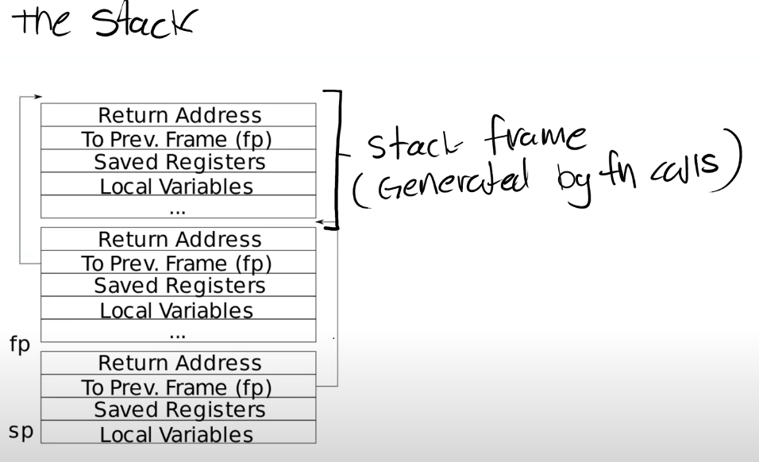

# Reference

- https://mit-public-courses-cn-translatio.gitbook.io/mit6-s081/lec05-calling-conventions-and-stack-frames-risc-v
- https://pdos.csail.mit.edu/6.S081/2020/lec/l-riscv.txt
- RISC-V ISA specification: https://riscv.org/specifications/
    Contains detailed information
- RISC-V ISA Reference: https://rv8.io/isa
    Overview of instructions
- RISC-V assembly language reference: https://rv8.io/asm
    Overview of directives, pseudo-instructions, and more

# 5.1 C程序到汇编程序的转换
ISA（Instruction Set Architecture）

C->ASM-> Binary(Object/.ofiles)


当我们说到一个RISC-V处理器时，意味着这个处理器能够理解RISC-V的指令集。所以，任何一个处理器都有一个关联的ISA（Instruction Sets Architecture），ISA就是处理器能够理解的指令集。每一条指令都有一个对应的二进制编码或者一个Opcode。当处理器在运行时，如果看见了这些编码，那么处理器就知道该做什么样的操作。上图中的处理器正好能理解RISC-V汇编语言。

所以通常来说，要让C语言能够运行在你的处理器之上。我们首先要写出C程序，之后这个C程序需要被编译成汇编语言。这个过程中有一些链接和其他的步骤，但是因为这门课不是一个编译器的课程，所以我们忽略这些步骤。之后汇编语言会被翻译成二进制文件也就是.obj或者.o文件。

汇编语言不具备C语言的组织结构，在汇编语言中你只能看到一行行的指令，比如add，mult等等。汇编语言中没有很好的控制流程，没有循环（注，但是有基于lable的跳转），虽然有函数但是与你们知道的C语言函数不太一样，汇编语言中的函数是以label的形式存在而不是真正的函数定义。汇编语言是一门非常底层的语言，许多其他语言，比如C++，都会编译成汇编语言。运行任何编译型语言之前都需要先生成汇编语言。

# 5.2 RISC-V vs x86

RISC-V和x86并没有它们第一眼看起来那么相似。RISC-V中的RISC是精简指令集（Reduced Instruction Set Computer）的意思，而x86通常被称为CISC，复杂指令集（Complex Instruction Set Computer）。这两者之间有一些关键的区别：

- 首先是指令的数量。
实际上，创造RISC-V的一个非常大的初衷就是因为Intel手册中指令数量太多了。x86-64指令介绍由3个文档组成，并且新的指令以每个月3条的速度在增加。因为x86-64是在1970年代发布的，所以我认为现在有多于15000条指令。RISC-V指令介绍由两个文档组成。在这节课中，不需要你们记住每一个RISC-V指令，但是如果你感兴趣或者你发现你不能理解某个具体的指令的话，在课程网站的参考页面有RISC-V指令的两个文档链接。这两个文档包含了RISC-V的指令集的所有信息，分别是240页和135页，相比x86的指令集文档要小得多的多。这是有关RISC-V比较好的一个方面。所以在RISC-V中，我们有更少的指令数量。

- 除此之外，RISC-V指令也更加简单。
  在x86-64中，很多指令都做了不止一件事情。这些指令中的每一条都执行了一系列复杂的操作并返回结果。但是RISC-V不会这样做，RISC-V的指令趋向于完成更简单的工作，相应的也消耗更少的CPU执行时间。这其实是设计人员的在底层设计时的取舍。并没有一些非常确定的原因说RISC比CISC更好。它们各自有各自的使用场景。

- 相比x86来说，RISC另一件有意思的事情是它是开源的。这是市场上唯一的一款开源指令集，这意味着任何人都可以为RISC-V开发主板。RISC-V是来自于UC-Berkly的一个研究项目，之后被大量的公司选中并做了支持，网上有这些公司的名单，许多大公司对于支持一个开源指令集都感兴趣。

如果查看RISC-V的文档，可以发现RISC-V的特殊之处在于：它区分了Base Integer Instruction Set和Standard Extension Instruction Set。Base Integer Instruction Set包含了所有的常用指令，比如add，mult。除此之外，处理器还可以选择性的支持Standard Extension Instruction Set。例如，一个处理器可以选择支持Standard Extension for Single-Precision Float-Point。这种模式使得RISC-V更容易支持向后兼容。 每一个RISC-V处理器可以声明支持了哪些扩展指令集，然后编译器可以根据支持的指令集来编译代码。


# 5.3 gdb和汇编代码执行

# 5.4 RISC-V寄存器


## RISC-V calling convention register usage.

| Register | ABI Name | Description                      | Saver  |
| -------- | -------- | -------------------------------- | ------ |
| x0       | zero     | Hard-wired zero                  | —      |
| x1       | ra       | Return address                   | Caller |
| x2       | sp       | Stack pointer                    | Callee |
| x3       | gp       | Global pointer                   | —      |
| x4       | tp       | Thread pointer                   | —      |
| x5–7     | t0–2     | Temporaries                      | Caller |
| x8       | s0/fp    | Saved register/frame pointer     | Callee |
| x9       | s1       | Saved register                   | Callee |
| x10–11   | a0–1     | Function arguments/return values | Caller |
| x12–17   | a2–7     | Function arguments               | Caller |
| x18–27   | s2–11    | Saved registers                  | Callee |
| x28–31   | t3–6     | Temporaries                      | Caller |
| f0–7     | ft0–7    | FP temporaries                   | Caller |
| f8–9     | fs0–1    | FP saved registers               | Callee |
| f10–11   | fa0–1    | FP arguments/return values       | Caller |
| f12–17   | fa2–7    | FP arguments                     | Caller |
| f18–27   | fs2–11   | FP saved registers               | Callee |
| f28–31   | ft8–11   | FP temporaries                   | Caller |


基本上来说，RISC-V中通常的指令是64bit，但是在Compressed Instruction中指令是16bit。在Compressed Instruction中我们使用更少的寄存器，也就是x8 - x15寄存器。


通常我们在谈到寄存器的时候，我们会用它们的ABI名字。不仅是因为这样描述更清晰和标准，同时也因为在写汇编代码的时候使用的也是ABI名字

为什么s1寄存器和其他的s寄存器是分开的，因为s1在Compressed Instruction是有效的，而s2-11却不是。除了Compressed Instruction，寄存器都是通过它们的ABI名字来引用


当我们调用函数时，你可以看到这里有a0 - a7寄存器。
a0到a7寄存器是用来作为函数的参数。如果一个函数有超过8个参数，我们就需要用内存了。从这里也可以看出，当可以使用寄存器的时候，我们不会使用内存，我们只在不得不使用内存的场景才使用它。


- Caller Saved寄存器在函数调用的时候不会保存
- Callee Saved寄存器在函数调用的时候会保存
- 
一个Caller Saved寄存器可能被其他函数重写。假设我们在函数a中调用函数b，任何被函数a使用的并且是Caller Saved寄存器，调用函数b可能重写这些寄存器。

Return address寄存器（注，保存的是函数返回的地址），你可以看到ra寄存器是Caller Saved，这一点很重要，它导致了当函数a调用函数b的时侯，b会重写Return address。


```bash

riscv64-linux-gnu-gcc -S -O0 kernel/demos.c -o kernel/demos.s

# Disassemble the object file After make
riscv64-linux-gnu-objdump -d kernel/demos.o > kernel/demos.asm
riscv64-linux-gnu-objdump -S -O0  kernel/demos.o > kernel/demos.asm

code  kernel/demos.asm
```


# 5.5 Stack


## Stack Frame


下面是一个非常简单的栈的结构图，其中每一个区域都是一个Stack Frame，每执行一次函数调用就会产生一个Stack Frame。



每一次我们调用一个函数，函数都会为自己创建一个Stack Frame，并且只给自己用。 函数通过移动Stack Pointer来完成Stack Frame的空间分配。
对于Stack来说，是从高地址开始向低地址使用。所以栈总是向下增长。当我们想要创建一个新的Stack Frame的时候，总是对当前的Stack Pointer做减法。

一个函数的Stack Frame包含了保存的寄存器，本地变量，并且，如果函数的参数多于8个，额外的参数会出现在Stack中。所以Stack Frame大小并不总是一样，即使在这个图里面看起来是一样大的。不同的函数有不同数量的本地变量，不同的寄存器，所以Stack Frame的大小是不一样的。但是有关Stack Frame有两件事情是确定的：
- Return address(ra) 总是会出现在Stack Frame的第一位
- 指向前一个Stack Frame的指针(fp)也会出现在栈中的固定位置


### Stack Frame 中有两个重要的寄存器
- SP（Stack Pointer），它指向Stack的底部并代表了当前Stack Frame的位置。
- FP（Frame Pointer），它指向当前Stack Frame的顶部。
  因为Return address和指向前一个Stack Frame的的指针都在当前Stack Frame的固定位置，所以可以通过当前的FP寄存器寻址到这两个数据。

我们保存前一个Stack Frame的指针的原因是为了让我们能跳转回去。所以当前函数返回时，我们可以将前一个Frame Pointer存储到FP寄存器中。所以我们使用Frame Pointer来操纵我们的Stack Frames，并确保我们总是指向正确的函数。

Stack Frame必须要被汇编代码创建，所以是编译器生成了汇编代码，进而创建了Stack Frame。所以通常，在汇编代码中，函数的最开始你们可以看到Function prologue，之后是函数的本体，最后是Epilogue。这就是一个汇编函数通常的样子。

## leaf函数
在我们之前的sum_to函数中，只有函数主体，并没有Stack Frame的内容。它这里能正常工作的原因是它足够简单，并且它是一个leaf函数。leaf函数是指不调用别的函数的函数，它的特别之处在于它不用担心保存自己的Return address或者任何其他的Caller Saved寄存器，因为它不会调用别的函数。

另一个函数sum_then_double就不是一个leaf函数了，这里你可以看到它调用了sum_to。


## Demo frame

```bash
b dummymain

(gdb) i frame
Stack level 0, frame at 0x3fffff9f80:
 pc = 0x800062fe in dummymain (kernel/demos.c:38);
    saved pc = 0x80006388
 called by frame at 0x3fffff9fb0
 source language c.
 Arglist at 0x3fffff9f80, args: argc=argc@entry=3,
    argv=argv@entry=0x3fffff9f88
 Locals at 0x3fffff9f80, Previous frame's sp is 0x3fffff9f80
Could not fetch register "ustatus"; remote failure reply 'E14

(gdb) backtrace
#0  dummymain (argc=argc@entry=3, argv=argv@entry=0x3fffff9f88)
    at kernel/demos.c:38
#1  0x0000000080006388 in demo4 () at kernel/demos.c:46
#2  0x0000000080002dd2 in sys_demo4 () at kernel/sysproc.c:121
#3  0x0000000080002b4a in syscall () at kernel/syscall.c:149
#4  0x0000000080002834 in usertrap () at kernel/trap.c:67
#5  0x000000000000008e in ?? ()


(gdb) frame 3
#3  0x0000000080002b4a in syscall () at kernel/syscall.c:149
   0x0000000080002b48 <syscall+60>:     82 97   jalr    a5
=> 0x0000000080002b4a <syscall+62>:     23 38 a9 06     sd      a0,112(s2)
   0x0000000080002b4e <syscall+66>:     39 a8   j       0x80002b6c <syscall+96>

(gdb) i frame
# Stack level 3, frame at 0x3fffff9fe0:
#  pc = 0x80002b4a in syscall (kernel/syscall.c:149); saved pc = 0x80002834
#  called by frame at 0x3fffffa000, caller of frame at 0x3fffff9fc0
#  source language c.
#  Arglist at 0x3fffff9fe0, args:
#  Locals at 0x3fffff9fe0, Previous frame's sp is 0x3fffff9fe0
#  Saved registers:
#   ra at 0x3fffff9fd8, fp at 0x3fffff9fd0, s1 at 0x3fffff9fc8, s2 at 0x3fffff9fc0, pc at 0x3fffff9fd8Could no
# t fetch register "ustatus"; remote failure reply 'E14'


(gdb) frame 0
#0  dummymain (argc=argc@entry=3, argv=argv@entry=0x3fffff9f88) at kernel/demos.c:38
=> 0x00000000800062fe <dummymain+0>:    63 56 a0 04     blez    a0,0x8000634a <dummymain+76>
   0x0000000080006302 <dummymain+4>:    79 71   addi    sp,sp,-48
   0x0000000080006304 <dummymain+6>:    06 f4   sd      ra,40(sp)
   0x0000000080006306 <dummymain+8>:    22 f0   sd      s0,32(sp)
   0x0000000080006308 <dummymain+10>:   26 ec   sd      s1,24(sp)
   0x000000008000630a <dummymain+12>:   4a e8   sd      s2,16(sp)
   0x000000008000630c <dummymain+14>:   4e e4   sd      s3,8(sp)
   0x000000008000630e <dummymain+16>:   52 e0   sd      s4,0(sp)
   0x0000000080006310 <dummymain+18>:   00 18   addi    s0,sp,48
   0x0000000080006312 <dummymain+20>:   aa 89   mv      s3,a0
   0x0000000080006314 <dummymain+22>:   2e 89   mv      s2,a1
   0x0000000080006316 <dummymain+24>:   81 44   li      s1,0
   0x0000000080006318 <dummymain+26>:   17 2a 00 00     auipc   s4,0x2
   0x000000008000631c <dummymain+30>:   13 0a 8a 57     addi    s4,s4,1400 # 0x8000889


# argv = 0x3fffff9f88   // pointer to an array of char* (argv[0], argv[1], ...)
# *argv = 0x800088a8     // argv[0] → points to "foo"
# So memory layout conceptually looks like:
# argv --> +0  → 0x800088a8 ──► "foo\0"
#          +8  → 0x800088b0 ──► "bar\0"
#          +16 → 0x800088b8 ──► "baz\0"

# argv points to an array of string pointers.
# argv[0] → "foo"
# argv[1] → "bar"
# argv[2] → "baz"

(gdb) i args
argc = 3
argv = 0x3fffff9f88

(gdb) p *argv
$7 = 0x800088a8 "foo"


(gdb) p *argv@2
$8 =   {0x800088a8 "foo",   0x800088b0 "bar"}


(gdb) p *argv@argc
$9 =   {0x800088a8 "foo",   0x800088b0 "bar",   0x800088b8 "baz"}


(gdb) p/x argv
$10 = 0x3fffff9f88

(gdb) x/s argv
0x3fffff9f88:   "\250\210"

# Dereference directly:
(gdb) p argv[0][0]
$11 = 102 'f'

(gdb) p argv[0][1]
$21 = 111 'o'

(gdb) p argv[0][7]
$24 = 0 '\000'

(gdb) p argv[0][8]
$23 = 98 'b'


# Using pointer arithmetic (explicit form):
(gdb) p **argv
$12 = 102 'f'

(gdb) p *(*(argv) + 1)
$22 = 111 'o'
# Explanation:
# argv points to an array of char*.
# *argv is the first char*, i.e. the address of "foo".
# *(argv) + 1 moves one byte forward → points to the second character.
# Another * dereference gets the character itself.


# Memory inspection style:
(gdb) x/c *argv
0x800088a8:     102 'f'

(gdb) x/c *argv+1
0x800088a9:     111 'o'


(gdb) x/2c *argv
0x800088a8:     102 'f' 111 'o'

(gdb) x/c *argv+8
0x800088b0:     98 'b'


(gdb) b demo_6

(gdb) i locals
i = 1
sum = 0


```
# 5.6 Struct


# Reference

## 主流指令集(Instruction Set Architectures ISA)与对应操作系统

---


当然可以！下面我会列出一些**主流的指令集架构（ISA）**，以及每种指令集上常见、流行或者经典的**操作系统（OS）**，方便你全面了解它们之间的对应关系。

| 指令集架构（ISA）          | 类型       | 特点简述                  | 支持的著名操作系统                                      |
| ------------------- | -------- | --------------------- | ---------------------------------------------- |
| **x86 / x86\_64**   | CISC     | 老牌 PC 架构，性能强，耗电大      | Windows, Linux 各发行版, BSD, macOS（老款Intel）       |
| **ARM / ARM64**     | RISC     | 高能效，主导移动设备，Apple M 芯片 | Android, iOS, Linux, Windows on ARM, HarmonyOS |
| **RISC-V**          | RISC（开源） | 完全开源，适合研究、嵌入式、芯片开发    | Linux（Debian, Fedora等）, FreeBSD, Zephyr, RTEMS |
| **MIPS**            | RISC     | 曾在嵌入式中流行，现多用于教育领域     | Linux, RTEMS, QNX, BSD                         |
| **Power / PowerPC** | RISC     | IBM 推出，曾用于旧 Mac、游戏机等  | AIX（IBM）, Linux（如Debian PPC）, AmigaOS          |
| **SPARC**           | RISC     | Sun 推出，多用于服务器         | Solaris, Linux（Debian SPARC）                   |
| **Itanium (IA-64)** | VLIW     | Intel/HP 推出，失败架构      | Windows Server（旧版本）, Linux                     |
| **Z/Architecture**  | CISC     | IBM 大型机架构             | z/OS, Linux on IBM Z                           |

---

## 详细举例

### 1. **x86 / x86\_64**

* 操作系统：

  * Microsoft Windows（包括 XP, 7, 10, 11 等）
  * 各种 Linux 发行版：Ubuntu, Debian, Fedora, Arch, CentOS…
  * FreeBSD, OpenBSD, NetBSD
  * macOS（10.15 Catalina 及更早版本使用 Intel x86）
  * ReactOS（Windows 克隆）
  * MS-DOS, FreeDOS
* 典型设备：台式机、笔记本、服务器

---

### 2. **ARM / ARM64**

* 操作系统：

  * Android（绝大多数手机和平板）
  * iOS（iPhone、iPad）
  * Linux（Raspberry Pi 就是 ARM 架构）
  * Windows 10/11 on ARM
  * HarmonyOS（华为）
  * macOS（Apple M 系列芯片，M1/M2）
* 典型设备：手机、平板、树莓派、嵌入式设备、Apple M1/M2 电脑

---

### 3. **RISC-V**

* 操作系统：

  * Linux（Debian RISC-V、Fedora RISC-V、Ubuntu RISC-V）
  * FreeBSD（有移植）
  * Zephyr、RTEMS、NuttX（RTOS）
  * xv6-riscv（MIT 教学OS）
  * seL4（安全微内核）
* 典型设备：实验开发板、开源硬件、嵌入式系统

---

### 4. **MIPS**

* 操作系统：

  * Linux（OpenWRT、Debian MIPS）
  * RTEMS、QNX（实时系统）
  * VxWorks
  * NetBSD
* 典型设备：路由器、交换机、嵌入式系统（逐渐被 RISC-V 取代）

---

### 5. **Power / PowerPC**

* 操作系统：

  * AIX（IBM 自研）
  * Linux（支持 PowerPC 的 Debian、RedHat）
  * AmigaOS（早期经典系统）
  * MorphOS（Amiga 类似系统）
  * macOS（早期 Mac G4、G5）
* 典型设备：IBM 服务器、旧款 Mac、某些游戏机（如 Xbox 360、PS3）

---

### 6. **SPARC**

* 操作系统：

  * Solaris（Sun/Oracle 主打 OS）
  * Linux（Debian SPARC 支持）
  * OpenBSD
* 典型设备：Sun/Oracle 服务器

---

### 7. **Itanium (IA-64)**

* 操作系统：

  * Windows Server（2003、2008 等）
  * Linux（旧版 Red Hat、SUSE）
* 典型设备：HP 和 Intel 的服务器，已基本淘汰

---

## 总结建议

如果你：

* 做通用桌面/服务器开发 👉 **x86\_64**
* 做移动/嵌入式/高能效产品 👉 **ARM/ARM64**
* 研究芯片/开源软硬件 👉 **RISC-V**
* 研究操作系统历史或移植 👉 可了解 MIPS, SPARC, PowerPC

---c

如果你感兴趣，我还可以做一张 **思维导图 / 对应图表** 来总结各 ISA 和 OS 的对应关系，要不要？


